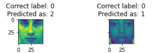

# Machine learning take-home assignment 

Quinten Cabo 
u789241 & 2042647 

### Special instructions to run the notebook
To run the notebook python 3.9 is required.
The following packages are also required:
- sklearn
- numpy 
- matplotlib
- imblearn

## Part 1: Classification of Facial Expressions 

### 1.2.1. Image figures

### 1.2.2. Histograms showing the data

959 data points were oversampled from the training set to balance the data

#### Is the dataset balanced?
**No**. The dataset was not balanced at all. There are almost double the targets with label 0 vs targets with label 1. Likewise there are almost double the targets with label 1 vs label 2

### 1.3.1. Accuracy of the KNN and other metrics

| Model            | K Nearest Neighbors     
|------------------|----------------------------|
| Parameter used   | K : 1                      | 
| Train score      | 1.0                        | 
| Test score       | 0.74                       |
| Precision score  | 0.736 0.890 0.5            | 
| Recal score      | 0.762 0.921   0.780        | 
| F1 score         | 0.819 0.929 0.64           | 
| Support          | 122  64  41                | 
| Training Seconds | 3.101                      |

#### 2 Misclassified images:

### 1.3.2. The hyperparameters found.  
K 1 till 87 where checked with steps of 2
The best K was K = 9

This K gave a baseline test score of **0.75** and a baseline train score of **0.76**

### 1.3.3. Table of the calssifiers that were used

| **Model**            | **Decision Tree**                                                                                                 | **Kernel SVM**                               | **Linear SVM**                 | **Naive Bayes**     |
|----------------------|-------------------------------------------------------------------------------------------------------------------|----------------------------------------------|--------------------------------|---------------------|
| **Best Parameters**  | criterion: entropy splitter: best max_depth: 9 max_features: auto ccp_alpha: 0.0 random_state: 137 | C: 100 kernel: 'rbf' random_state: 137 | C: 0.0001 random_state: 137 | None                |
| **Train Score**      | 0.86                                                                                                              | 1.0                                          | 0.87                           | 0.62                |
| **Test Score**       | 0.71                                                                                                              | 0.85                                         | 0.83                           | 0.63                |
| **Validation Score** | 0.63                                                                                                              | 0.90                                         | 0.84                           | 0.65                |
| **Precision**        | [0.756 0.71  0.553]                                                                                               | [0.855 0.966 0.676]                          | [0.892 0.924 0.56 ]            | [0.617 0.917 0.5  ] |
| **Recal**            | [0.787 0.688 0.512]                                                                                               | [0.918 0.891 0.61 ]                          | [0.811 0.953 0.683]            | [0.885 0.344 0.341] |
| **F1**               | [0.771 0.698 0.532]                                                                                               | [0.918 0.891 0.61 ]                          | [0.85  0.938 0.615]            | [0.727 0.5   0.406] |
| **Support**          | [122  64  41]                                                                                                     | [122.  64.  41.]                             | [122.  64.  41.]               | [122.  64.  41.]    |
| **Training Seconds** | 0.077                                                                                                             | 0.723                                        | 3.551                          | 0.012               |

| **Model**            | **Random Forest**                                           | **Gradient Boosting**                                                | **Ensemble voting**                                   |
|----------------------|-------------------------------------------------------------|----------------------------------------------------------------------|-------------------------------------------------------|
| **Best Parameters**  | n_estimators: 200 criterion: 'gini' random_state: 137 | n_estimators: 200 criterion: 'friedman_mse'  random_state: 137 | estimators = 'best other models'   voting = 'hard' |
| **Train Score**      | 1.0                                                         | 1.0                                                                  | 0.96                                                  |
| **Test Score**       | 0.84                                                        | 0.86                                                                 | 0.84                                                  |
| **Validation Score** | 0.81                                                        | 0.88                                                                 | 0.84                                                  |
| **Precision**        | [0.791 0.963 0.84 ]                                         | [0.855 0.949 0.73 ]                                                  | [0.736 0.891 0.5  ]                                   |
| **Recal**            | [0.959 0.812 0.512]                                         | [0.918 0.875 0.659]                                                  | [0.869 0.766 0.341]                                   |
| **F1**               | [0.867 0.881 0.636]                                         | [0.885 0.911 0.692]                                                  | [0.797 0.824 0.406]                                   |
| **Support**          | [122.  64.  41.]                                            | [122.  64.  41.]                                                     | [122.  64.  41.]                                      |
| **Training Seconds** | 4.618                                                       | 75.809                                                               | 73.506                                                |

#### Which was your best pipeline or classifier and with what parameters?  
The best classifier that I found was a Kernel Support Vector Machine with C=100, kernel: 'rbr' and 'random_state': 137. It had a validation score of 0.9. The highest validation score out of all models.

#### Did you beat the baseline classifier?
I beat the baseline classifier with all models except Naive Bayes and Decision Trees. 

## Part 2: Regression to estimate the width of a grey kangaroo’s nose

### 2.2.1. The plot

### 2.3.2. The R2 result
The linear regression got an R2 score 0.777.

### 2.3.3. Mean R2 score 
The Cross validated R2 scores were `[ 0.6176  0.635  0.901 -1.487  0.502]`.
The Mean R2 score was 0.234

### 2.3.4. Each regressor with it corresponding score + figure
| Model     | Linear Regression | Support Vector Regression | Decision Tree Regression |
|-----------|-------------------|---------------------------|--------------------------|
| R2 score  | 0.234             | 0.86                      | 0.864                    |

#### Which is the best regressor? 
Decision Tree Regression was the best regression method. 

### 2.4. The imputation method results
| Model    | Mean imputation | KNN imputation (k=3) |
|----------|-----------------|----------------------|
| R2 score | 0.617           | 0.7                  |

#### Which is the best data imputation method? 
The KNN imputation method was the best. With a score of 0.7

### Resources used:

- [Python documentation](https://docs.python.org/3/) (https://docs.python.org/3/)
- [Table generator](https://www.tablesgenerator.com/markdown_tables) (https://www.tablesgenerator.com/)
- [SKlearn documentation](https://scikit-learn.org/) (https://scikit-learn.org/)

#### Stackoverflow:
- https://stackoverflow.com/questions/9031783/hide-all-warnings-in-ipython
- https://stackoverflow.com/questions/33885051/using-spyder-python-to-open-npy-file
- https://stackoverflow.com/questions/9541025/how-to-copy-a-python-class
- https://stackoverflow.com/questions/55767312/how-to-position-suptitle
- https://stackoverflow.com/questions/39539476/how-to-sharex-and-sharey-axis-in-for-loop
- https://stackoverflow.com/questions/17753398/using-matplotlib-is-it-possible-to-set-properties-for-all-subplots-on-a-figure
- https://stackoverflow.com/questions/43162506/undefinedmetricwarning-f-score-is-ill-defined-and-being-set-to-0-0-in-labels-wi
- https://stackoverflow.com/questions/45554008/error-in-python-script-expected-2d-array-got-1d-array-instead
- https://stackoverflow.com/questions/4455076/how-to-access-the-ith-column-of-a-numpy-multidimensional-array-https://stackoverflow.com/questions/52763325/how-to-obtain-only-the-name-of-a-models-object-in-scikitlearn
- https://stackoverflow.com/questions/38068669/dynamic-for-loops-in-python
- https://stackoverflow.com/questions/36901/what-does-double-star-asterisk-and-star-asterisk-do-for-parameters
- https://stackoverflow.com/questions/27122757/sklearn-set-params-takes-exactly-1-argument
- https://stackoverflow.com/questions/11351032/named-tuple-and-default-values-for-optional-keyword-arguments
